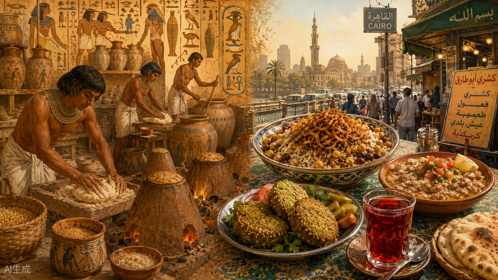
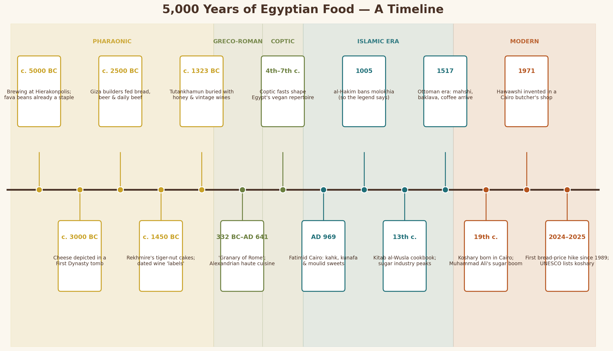
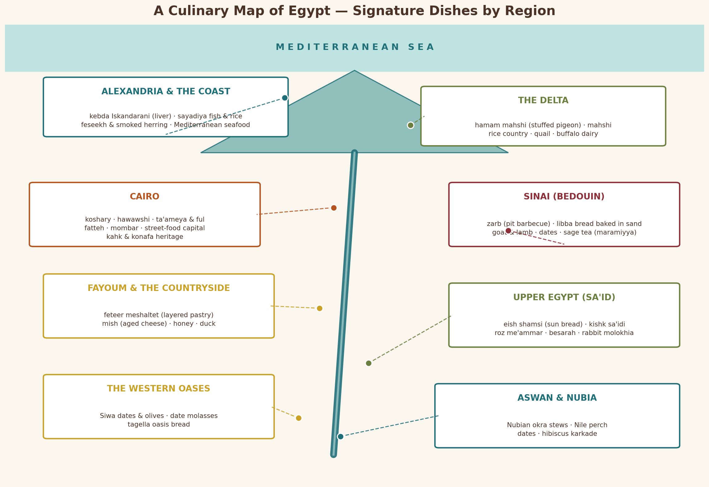
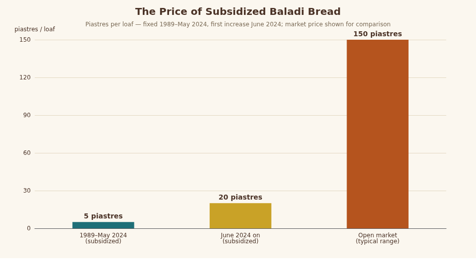
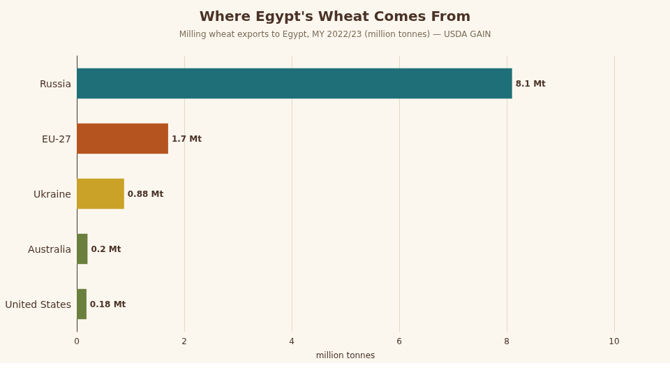
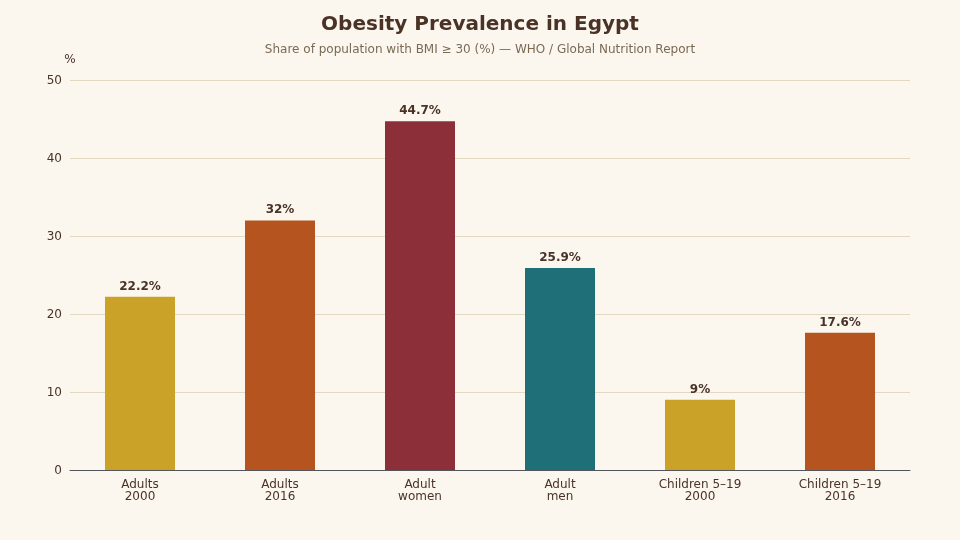

# From Pharaohs to Koshary: 5,000 Years of Food and Cooking in Egypt

## Executive Summary

Few countries on earth can trace what is on the dinner plate tonight back five thousand years with as much continuity as Egypt. The same civilization that mass-produced conical loaves for pyramid builders and dated its wine jars like modern vintage labels still eats fava beans for breakfast, still ferments fish for a spring festival that predates both Christianity and Islam, and still calls bread *aish* — literally "life." This report traces Egyptian food and cooking across its full arc: the emmer-and-beer economy of the pharaohs, the fasting cuisine of the Copts, the sugar-sweet court culture of Fatimid Cairo, the Ottoman layering of stuffed vegetables and coffee, and the modern street-food nation that invented koshary barely 170 years ago and saw it inscribed on UNESCO's Intangible Cultural Heritage list in December 2025  [(新华网)](http://english.news.cn/20251211/4fde75a8f35b472395927a5970cac851/c.html) .

Along the way the report separates fact from legend, because Egyptian food history is thick with both. The "radishes and garlic" that Herodotus claimed were inscribed on the Great Pyramid as workers' rations turn out to be a translation error  [(Herodotus Helpline)](https://herodotushelpline.org/how-accurate-is-herodotus-description-of-egypt/) . Molokhia was never "the food of kings"  [(Serious Eats)](https://www.seriouseats.com/molokhia-recipe-egyptian-jute-mallow-soup-8627832) . Om Ali was probably never a vengeful sultana's celebratory pudding  [(Chez Nermine)](https://cheznermine.com/2023/02/09/om-ali-is-an-iconic-egyptian-dessert/) . Yet the verified facts are stranger than the myths: archaeologists have baked bread with 4,500-year-old revived yeast  [(annerenwick.com)](https://www.annerenwick.com/beer-and-bread-from-ancient-yeast/) , chemists have identified red wine residues in Tutankhamun's amphorae  [(copernicus.org)](https://isprs-annals.copernicus.org/articles/II-5-W1/157/2013/isprsannals-II-5-W1-157-2013.pdf) , and modern Egypt runs the largest state bread-subsidy system on the planet — roughly **250–270 million subsidized loaves a day**  [(millermagazine.com)](https://millermagazine.com/blog/focus-on-egypt-grain-and-wheat-policy-2685) , whose price was frozen from 1989 until June 2024  [(IFPRI : International Food Policy Research Institute)](https://www.ifpri.org/blog/egypt-increases-price-of-subsidized-bread-for-the-first-time-since-1989-implications-for-nutrition-and-food-security/) .

---

## 1. The Ancient Table: Food in Pharaonic Egypt

### 1.1 Bread and beer: the twin pillars of civilization

Ancient Egypt ran on two products made from the same raw materials: bread and beer. The staple cereal was **emmer wheat**, processed with enormous labor — the spikelets had to be pounded in mortars to release the grain, then sieved, ground on stone querns, and kneaded into dough — a workflow reconstructed experimentally by archaeobotanist Delwen Samuel from residues and tomb models  [(UCL Blogs)](https://blogs.ucl.ac.uk/researchers-in-museums/2017/02/09/3500-year-old-bread-and-beer-from-the-new-kingdom-egypt/) . Egyptians baked their bread in dozens of forms: one count identifies at least **40 distinct types of bread and cakes** by name in the texts, from flat griddle loaves to the conical loaves baked in mass-produced clay *bedja* molds that turn up by the thousands at settlement and temple sites  [(Nautilus)](https://nautil.us/how-to-make-the-bread-that-fueled-the-pyramids-1223483) . Beer was brewed in matching industrial volumes: the grains were lightly baked, crumbled, soaked, and fermented into a thick, nutritious, mildly alcoholic staple that functioned as both drink and food, with at least ten named varieties differentiated by strength and flavorings such as dates  [(Nautilus)](https://nautil.us/how-to-make-the-bread-that-fueled-the-pyramids-1223483) .

The scale of this industry is hard to overstate. Beer was so central that it served as **currency and wages** — standard labor rations combined bread and beer, and the combined hieroglyphs for the two words functioned as a common everyday greeting, roughly "hello and good health"  [(wikipedia.org)](https://en.wikipedia.org/wiki/Ancient_Egyptian_cuisine) . Ration estimates for heavy laborers run to about **ten pints of beer per day**  [(Nautilus)](https://nautil.us/how-to-make-the-bread-that-fueled-the-pyramids-1223483) . Even the gods drank: the festival calendar included the *Festival of Drunkenness* honoring Hathor, commemorating the myth in which humanity was saved from destruction when the lioness-goddess Sekhmet was tricked into drinking **blood-red beer**, mistaking it for blood, and passing out drunk  [(wikipedia.org)](https://en.wikipedia.org/wiki/Hathor) . Brewing itself was state infrastructure: some of the world's oldest known industrial breweries, at sites like Hierakonpolis and Abydos, date back more than five thousand years, and five-thousand-year-old wine jars from the tomb of King Merneith at Abydos rank among the oldest surviving alcoholic beverages anywhere  [(newsweek.com)](https://www.newsweek.com/sealed-5000-year-old-wine-jars-ancient-egypt-unearthed-1831382) .

### 1.2 What else was on the pharaonic menu

Beneath the bread-and-beer economy lay a broad, strongly seasonal cuisine built on the Nile flood. Alliums were the backbone of flavoring — **onions, garlic, and leeks** appear constantly in offering lists, medical papyri, and worker rations — alongside pulses (fava beans, lentils, chickpeas, peas) and leafy greens. Lettuce held a special place: the tall, milky-sapped romaine type was sacred to the fertility god Min and depicted in his temples  [(wikipedia.org)](https://en.wikipedia.org/wiki/Ancient_Egyptian_cuisine) . The fruit basket was equally characteristic: **dates, dom-palm nuts, sycamore figs, grapes, figs, pomegranates, and melons**, with sweetening supplied almost entirely by honey and date syrup  [(wikipedia.org)](https://en.wikipedia.org/wiki/Ancient_Egyptian_cuisine) . Watermelons, incidentally, are an African native: tomb paintings show them being eaten in Egypt some **4,000 years ago**, though genomic work on the plant suggests the wild ancestor was a pale, bitter-fleshed melon from the Kordofan region of Sudan that Egyptians selected into the sweet red fruit over centuries  [(wikipedia.org)](https://en.wikipedia.org/wiki/Watermelon) .

Protein marked class lines sharply. Fish and fowl were the everyday animal foods of ordinary people — the Nile teemed, and Herodotus recorded Egyptians eating fish both raw and sun-dried or salted, the ancestor of today's *feseekh*  [(wikipedia.org)](https://en.wikipedia.org/wiki/Fesikh) . Beef was the luxury and the festival food, supplied by temple and estate herds and famously issued to state labor crews (see below). Egyptians fattened geese and ducks by force-feeding — tomb scenes from around **2500 BC show the practice that the French later named foie gras**  [(wikipedia.org)](https://en.wikipedia.org/wiki/Ancient_Egyptian_cuisine) . The adventurous end of the menu included hedgehog baked in a clay casing that was cracked open to remove the spines, and a medical-aphrodisiac recipe calling for **forty-one sparrows**  [(wikipedia.org)](https://en.wikipedia.org/wiki/Ancient_Egyptian_cuisine) . Dairy appears from the very beginning of the state: a cheese-making scene survives from a **First Dynasty tomb (~3000 BC)**, among the earliest depictions of cheese anywhere  [(wikipedia.org)](https://en.wikipedia.org/wiki/Egypt) . For dessert, tomb paintings in the 15th-century-BC tomb of the vizier Rekhmire show conical sweets made from **tiger nuts** (*hab al-aziz*, the tubers of *Cyperus esculentus*) ground with honey and fat — often described as the oldest documented confectionery recipe in the world  [(The Food Dictator)](https://www.thefooddictator.com/the-hirshon-ancient-egyptian-tiger-nut-cones/) .

### 1.3 Feeding the pyramid builders: the first documented mass catering

The best-studied ancient food operation in Egypt is not a royal kitchen but a workers' town. Excavations at **Heit el-Ghurab**, the settlement of the pyramid builders at Giza (c. 2500 BC), uncovered industrial bakeries, breweries, and vast quantities of animal bone showing that the labor force — paid rotating crews, not slaves — ate astonishingly well by ancient standards: daily bread and beer rations plus **beef, sheep, and goat supplied at a scale that could feed several thousand people meat every day**  [(wikipedia.org)](https://en.wikipedia.org/wiki/Ancient_Egypt) . Grain wages for such crews are documented at around 200 kg per month, far above subsistence, reflecting the state's need to attract and keep muscle  [(wikipedia.org)](https://en.wikipedia.org/wiki/Ancient_Egypt) .

This archaeological picture matters because it directly contradicts the most famous ancient claim about pyramid-builder food. Herodotus reported an inscription on the Great Pyramid recording what was spent on **radishes, onions, and garlic** for the workforce — a passage beloved of tour guides. The word translated as "radishes" in early editions almost certainly referred to something else entirely (the Greek term was misunderstood; later scholars connect the passage to a staff or to purges), and no such inscription survives — the whole episode is now treated as a guide-story Herodotus picked up and a mistranslation layered on top  [(Herodotus Helpline)](https://herodotushelpline.org/how-accurate-is-herodotus-description-of-egypt/) . The real pyramid diet, as the bones and bakeries show, was bread, beer, onions, and beef.

### 1.4 Wine, honey, and the high table

If beer was democratic, wine was aristocratic, and the Egyptians managed it with a sophistication that reads as startlingly modern. Amphorae were labeled like modern bottles — **vintage year, vineyard or estate, region, and even the named chief vintner** — and Tutankhamun was buried with a cellar of labeled wines intended to accompany him  [(berba.rs)](https://www.berba.rs/blog/a-brief-history-of-wine-labels/) . Chemical analysis of residues has settled old debates: scrapings from jars in Tutankhamun's tomb contained syringic acid markers proving they held **red wine**, and identified the fabled *shedeh* — long argued to be pomegranate wine — as a red grape wine  [(copernicus.org)](https://isprs-annals.copernicus.org/articles/II-5-W1/157/2013/isprsannals-II-5-W1-157-2013.pdf) . Wine prices ran many times higher than beer, anchoring it to elite and ritual consumption  [(berba.rs)](https://www.berba.rs/blog/a-brief-history-of-wine-labels/) .

Honey was the other luxury liquid, serving as sweetener, medicine, offering, and tribute, and it gave rise to one of the most repeated (and in this case essentially true) food facts in archaeology: sealed pots of **honey thousands of years old** found in Egyptian tombs have proved still edible, thanks to honey's low moisture, acidity, and hydrogen-peroxide chemistry  [(Space Daily)](https://spacedaily.com/j-honey-recovered-from-egyptian-tombs-sealed-more-than-3000-years-ago-has-been-found-still-edible-because-honeys-low-water-content-acidic-ph-and-the-hydrogen-peroxide-produced-by-bee-enzymes-create-an/) . Banqueting scenes in New Kingdom tombs complete the picture of elite dining — guests cone-headed with scented fat, tables loaded with roast fowl, beef, cakes, fruit, and wine — while the funerary economy turned food itself into eternal provisioning, with offering tables, model bakeries, and actual mummified cuts of meat ("victual mummies") packed for the afterlife  [(wikipedia.org)](https://en.wikipedia.org/wiki/Ancient_Egyptian_cuisine) .

---

## 2. Faith and Conquest: Greco-Roman, Coptic, and Medieval Islamic Egypt

### 2.1 From the granary of empires to the fasting table

Alexander's conquest in 332 BC and the Roman annexation three centuries later converted Egypt into the **breadbasket of the Mediterranean**: Nile grain fed Rome and later Constantinople, and Alexandrian cooks gained a wide reputation in the classical world  [(wikipedia.org)](https://en.wikipedia.org/wiki/Ancient_Egyptian_cuisine) . Ptolemaic Alexandria became the ancient world's most fashionable food city — a cosmopolitan port where Greek cooks, Egyptian ingredients, and imported wine mixed freely, and whose gastronomic reputation classical authors remarked on for centuries. Roman rule intensified the extractive side of the equation: Egypt's grain fleet was a strategic asset of the empire, and the annona — the subsidized grain supply of Rome — depended on the Nile harvest, making Egypt the first society in history whose domestic food economy was organized around feeding a foreign capital  [(wikipedia.org)](https://en.wikipedia.org/wiki/Ancient_Egyptian_cuisine) . 

The deeper transformation of everyday eating, however, came with Christianity. The Coptic Church built one of the most demanding fasting regimes in Christianity — by traditional count roughly **180–210 fasting days a year** in which the devout abstain from all animal products  [(ekb.eg)](https://thalexu.journals.ekb.eg/article_247272_6db00ddc974d7116dfbfdb5c3f9cb14b.pdf) . Centuries of fasting discipline left a permanent mark on the national kitchen: Egypt's deep repertoire of **vegan dishes** — lentils, chickpeas, fava beans, tahini-based sauces, oil-fried vegetables — owes much to the Coptic calendar, and several candidates for Egypt's national dish, including *ta'ameya* (fava-bean falafel) and *ful medames*, are routinely traced to Coptic fasting tables  [(rjpbcs.com)](https://www.rjpbcs.com/pdf/2016_7(5)/[68].pdf) . Even outside the fasts, the rhythm of abstinence and feast structured the food year, with fish permitted on some fasting days and great communal feasts at Easter and the saints' festivals  [(Dailynewsegypt)](https://www.dailynewsegypt.com/2013/03/13/lent-in-the-coptic-church/) .

### 2.2 Fatimid Cairo: sugar, spectacle, and the invention of food festivals

The founding of Cairo by the Fatimids in AD 969 turned Egypt into the center of a wealthy, cosmopolitan caliphate, and food became an instrument of state theater. The Fatimids institutionalized public feasting at religious festivals: at the **Mawlid al-Nabi** (the Prophet's birthday, a festival the Fatimids themselves promoted) the state distributed enormous quantities of honey-based sweets to the populace — a 12th-century account describes a distribution in 1122 — establishing the sweet-seller as a fixture of Egyptian festive life that persists in today's *halawet el-moulid* sugar dolls and nut brittle  [(wikipedia.org)](https://en.wikipedia.org/wiki/Mawlid) . The signature Eid cookie **kahk**, whose name is itself a Coptic word and whose decorated, stamped rounds echo tomb depictions of honey-cakes, was mass-produced by the Fatimid state bakery (the *Diwan al-Fitr*), stuffed on occasion with gold dinars as caliphal largesse, and survives today as the indispensable cookie of Eid al-Fitr  [(Food52)](https://food52.com/recipes/87745-best-kahk-eid-cookies-recipe) . **Kunafa**, by the best-documented account, appeared in Fatimid Cairo — one popular story ties its debut to the caliph al-Mu'izz's ceremonial entry into the city during Ramadan — before spreading across the Levant and Turkey  [(Senabel Store)](https://senabel.com/en/learn-about-the-origins-of-knafeh-with-qash/) .

The Fatimid centuries also gave Egypt its most durable food legend. The "mad caliph" **al-Hakim bi-Amr Allah** is said around 1005 to have banned **molokhia** (jute mallow), along with mullet and other foods, for reasons variously given as its aphrodisiac reputation or its association with the name of a rival caliph — al-Maqrizi records the molokhia ban among his decrees, and the dish's near-sacred status among Egyptians is sometimes jokingly attributed to the forbidden-fruit effect  [(wikipedia.org)](https://en.wikipedia.org/wiki/Mulukhiyah) .

### 2.3 The medieval cookbooks: Egypt's golden age of recipe writing

Mamluk-era Egypt produced one of the great documents of world food history: the anonymous 13th-century **Kitab al-Wusla ila al-Habib fi Wasf al-Tayyibat wa'l-Tib** ("The Book of the Bond with the Beloved, on the Description of Fine Dishes and Perfumes"), a Syrian-Egyptian cookbook preserving some **635 recipes** — stews, roasts, pickles, sweets, and drinks — that capture the sophisticated Arab-Islamic high cuisine of the medieval Nile valley at its peak  [(wikipedia.org)](https://en.wikipedia.org/wiki/Kitab_al-Wuslah_ila_l-habib) . The collection is a goldmine for food historians tracing modern dishes backward: it contains early ancestors of **hawawshi** (spiced meat baked in bread), one of the earliest written recipes resembling **hummus**, and layered meat-and-bread dishes that prefigure today's *fattah*  [(NYU Press)](https://nyupress.org/blog/2017/05/02/recipes-13th-century-syria/) . 

Egypt's medieval prosperity also rested on a now-forgotten industrial crop: **sugar**. Sugarcane had been cultivated in Egypt since the early Islamic centuries, and medieval Egypt became a leading sugar producer and exporter, supplying the sweet-toothed courts of the Middle East and Europe before Atlantic plantations undercut it; Muhammad Ali would attempt a sugarcane revival in the 19th century as part of his cash-crop program  [(wikipedia.org)](https://en.wikipedia.org/wiki/Egyptians) .

### 2.4 Ottoman centuries and the peasant baseline

Under Ottoman rule from 1517, Egyptian elite cooking absorbed the imperial repertoire — **mahshi** (vegetables stuffed with rice and herbs), baklava-style pastries, pilafs, and coffee, which arrived via Yemen and turned the Cairene coffeehouse (*ahwa*) into a defining social institution. Yet foreign observers of the 17th century describe the mass of the population living on the ancient baseline: **bread, onions, legumes, and salt-cured fish**, with meat a rarity and sweet things the mark of celebration  [(wikipedia.org)](https://en.wikipedia.org/wiki/Egyptian_cuisine) . 

Egyptian food history has a dual character that persists to this day — an elaborate, cosmopolitan court and merchant cuisine layered over a peasant table that changed remarkably little between the Old Kingdom and the 19th century  [(wikipedia.org)](https://en.wikipedia.org/wiki/Egyptian_cuisine) . Several of the dishes on that peasant table — sun-baked bread, fava-bean stew, salted fish, jute-mallow soup, honey-cakes — are direct continuations of pharaonic foods, making Egypt arguably the world's longest continuously documented national cuisine  [(wikipedia.org)](https://en.wikipedia.org/wiki/Ancient_Egyptian_cuisine) .

---
## 3. The Modern National Table

### 3.1 Koshary: the accidental national dish, and a UNESCO debut

Egypt's most famous dish is also one of its youngest. **Koshary** — the carbohydrate architecture of rice, lentils, macaroni, and chickpeas crowned with tomato-vinegar sauce, garlic, and crispy fried onions — crystallized in 19th-century Cairo, probably from the meeting of Indian *khichri* (brought by British-linked soldiers and trade), Italian pasta (via Egypt's large Italian community), and the local lentil-and-rice dish *mujaddara*  [(wikipedia.org)](https://en.wikipedia.org/wiki/Koshary) . The earliest hard sighting is a wonderful one: the explorer **Richard Burton recorded eating koshary at Suez in 1853**, describing it as the Egyptian version of "kichri"  [(shorthandstories.com)](https://world-appetite.shorthandstories.com/history-of-koshary-abou-tarek/index.html) . 

Cookbook author Claudia Roden, who grew up in Cairo, recalls that koshary was simply **not part of the city's food scene before 1952** and spread explosively afterward as cheap, filling urban fuel — pushed by street carts, of which the most famous, Abou Tarek's, began as a Cairo pushcart in 1950 and grew into a multi-story koshary palace  [(NPR)](https://www.npr.org/sections/thesalt/2017/02/22/512920687/egypts-beloved-koshary-is-a-modern-mystery-in-an-ancient-cuisine) . In **December 2025 UNESCO inscribed koshary on the Representative List of the Intangible Cultural Heritage of Humanity**, recognizing it as a living daily practice shared across every class and region of Egypt  [(新华网)](http://english.news.cn/20251211/4fde75a8f35b472395927a5970cac851/c.html) . One caution for myth-hunters: a circulating claim that koshary descends from a pharaonic dish called "Koshir" mentioned by Manetho rests on no verifiable source  [(wikipedia.org)](https://en.wikipedia.org/wiki/Koshary) .

### 3.2 Ful medames and ta'ameya: the bean that built breakfast

If koshary is the young celebrity, **ful medames** is the ancient patriarch. Slow-simmered fava beans — the word *medames* refers to the pot "buried" in low heat to cook overnight, traditionally in the embers of the public bathhouse fires, a practice the Victorian chronicler Edward Lane described in Cairo and that lives on in folk etymologies tying the dish to the old "Princess Baths" qidra pots  [(wikipedia.org)](https://en.wikipedia.org/wiki/Ful_medames) . Fava beans themselves were cultivated in Egypt for millennia (though, curiously, ancient texts treated them ambivalently — some priestly circles shunned beans), and today ful is eaten by virtually every Egyptian, dressed with oil, lemon, cumin, and garlic, at breakfasts from village benches to five-star buffets  [(wikipedia.org)](https://en.wikipedia.org/wiki/Ful_medames) . 

Its fried sibling, **ta'ameya** — Egypt's falafel, made from **split fava beans rather than the chickpeas used in the Levant**, green with herbs and sesame-crusted — is by tradition a Coptic invention, the very name deriving from a Coptic word for food, created as rich-tasting fasting fare; the earliest firm written references date to the 19th century, and the question of whether falafel was born in Egypt and migrated east remains a friendly but genuine point of contention with the Levant  [(wikipedia.org)](https://en.wikipedia.org/wiki/Falafel) .

### 3.3 Molokhia: the green soup with a thousand-year grudge

**Molokhia** — the slick, garlicky soup of chopped jute-mallow leaves, usually finished with a *ta'leya* of garlic sizzled in ghee and served over rice with rabbit, chicken, or (on the coast) shrimp — is the dish Egyptians are most sentimental about. It is genuinely old: medieval authors including al-Maqrizi discuss *mulukhiyah*, and legend names it as a favorite of the caliph Mu'awiya  [(wikipedia.org)](https://en.wikipedia.org/wiki/Mulukhiyah) . It is also the subject of two stubborn myths worth puncturing. The story that molokhia was **"the food of kings"** — a royal dish so precious that al-Hakim forbade it to commoners — has been picked apart by food historian Mennat-Allah El Dorry: there is no ancient evidence molokhia was ever a royal monopoly, and the "food of kings" etymology (*mulukiya* = "royal") post-dates the dish, which early sources simply called *bamia*-style greens; what al-Hakim's famous ban actually did, if anything, was cement the soup's popularity through the allure of the forbidden  [(Serious Eats)](https://www.seriouseats.com/molokhia-recipe-egyptian-jute-mallow-soup-8627832) . 

Modern molokhia geography is a study in itself: Minya and Upper Egypt favor it with rabbit, Alexandria with shrimp, and every region insists its consistency — whole leaf versus finely minced — is the correct one  [(wikipedia.org)](https://en.wikipedia.org/wiki/Mulukhiyah) .

### 3.4 The supporting cast: feteer, hawawshi, mahshi, and the festive meats

Egypt's layered pastry **feteer meshaltet** — paper-thin dough folded with ghee into dozens of strata, baked in a wood-fired oven and eaten sweet (with honey and cream) or savory (with cheese and pastrami) — has the most venerable pedigree of any pastry in the country: its ancestor, *maltoat*, appears as a **temple offering in pharaonic texts**, and medieval travelers recorded villages presenting feteer to distinguished guests, a hospitality custom still alive in the countryside today  [(Feteers)](https://feteers.com/blog/what-is-egyptian-feteer) . 

**Hawawshi**, by contrast, is a proud modern invention: spiced minced meat stuffed into baladi bread and baked until the crust crackles, created in the early 1970s by a butcher named **Ahmed al-Hawawsh** at his shop in Cairo's Tawfeek market, from where it conquered the nation within a decade  [(Caroline's Cooking)](https://www.carolinescooking.com/hawawshi-meat-pitas/) . The rest of the festive canon shows the Ottoman and village layers of the cuisine: **mahshi** (zucchini, vine leaves, eggplant, and peppers stuffed with herbed rice), **hamam mahshi** (squab pigeon stuffed with cracked wheat or rice, a Delta specialty), **mombar** (rice-stuffed beef sausage), and **fattah** — the Celebration dish of Eid al-Adha, a strata of crispy bread, rice, and boiled meat drenched in garlic-vinegar broth whose layered form echoes recipes in the medieval cookbooks  [(wikipedia.org)](https://en.wikipedia.org/wiki/Egyptian_cuisine) .

### 3.5 Bread is life: the word itself says so

No fact about Egyptian food is more telling than the language: Egyptian Arabic calls bread ***aish*** — the ordinary word for **"life"** — and baladi bread (*aish baladi*, "bread of the countryside") remains the flat, bran-rich, pocketed whole-wheat loaf that anchors every meal, often doubling as spoon, plate, and napkin  [(ekb.eg)](https://pijth.journals.ekb.eg/article_414069_975d0018b3a5a3fab208948a942e91dc.pdf) . The national bread family is large — one count runs to dozens of regional types — and includes **eish fino** (the European-style baguette-like loaf introduced via Alexandria's cosmopolitan bakeries), **eish shamsi** ("sun bread," the thick, sourdough, sun-fermented loaf of Upper Egypt), and the soft *shami* loaves of the Delta  [(wikipedia.org)](https://en.wikipedia.org/wiki/Egyptian_cuisine) . 

Upper Egyptian *eish shamsi* deserves special mention as a living fossil: the dough is leavened with a starter and traditionally fermented in the sun before baking, a technique described in pharaonic-era baking and still standard in Sa'idi villages  [(wikipedia.org)](https://en.wikipedia.org/wiki/Eish_shamsi) . Behind this culture stands the enormous state apparatus of subsidized bread — examined in Section 7 — which guarantees that even the poorest Egyptian eats, and which makes bread the most politically sensitive substance in the country  [(millermagazine.com)](https://millermagazine.com/blog/focus-on-egypt-grain-and-wheat-policy-2685) .

### 3.6 What Egypt drinks

Egypt is a tea and juice civilization built on a coffeehouse frame. **Tea** (*shai*) is the true national drink — brewed strong, drunk sweet, consumed in staggering quantities at every hour — while **Turkish-style coffee** anchors the *ahwa*, the traditional coffeehouse that arrived with Ottoman rule and became the male social club of every Egyptian street, complete with backgammon, dominoes, and shisha  [(wikipedia.org)](https://en.wikipedia.org/wiki/Egyptian_cuisine) . The street belongs to the juice carts: fresh **sugarcane juice** ('asab), crushed to order through roaring presses — a drink with deep roots in a country that grew sugarcane from the medieval period and tried to rebuild an industry around it under Muhammad Ali  [(wikipedia.org)](https://en.wikipedia.org/wiki/Egyptians)  — alongside iced **karkade** (hibiscus, crimson and tart, the pride of Nubia), *tamr hindi* (tamarind), *erk sous* (licorice-root water, sold by famously photogenic vendors in drip-catching brass tanks), and winter **sahlab**, the hot, thick orchid-root milk drink topped with nuts and cinnamon  [(wikipedia.org)](https://en.wikipedia.org/wiki/Egyptian_cuisine) .

Two drinks deserve special footnotes. **Bouza** — a thick, sour, lightly alcoholic wheat beer sold in old-school Cairo bouza bars — is a direct descendant of pharaonic brewing, making it one of the oldest continuously produced beverages on earth  [(wikipedia.org)](https://en.wikipedia.org/wiki/Egypt) . And Ramadan has its own liquid canon: **qamar el-din** (apricot-leather juice), **sobia** (a chilled coconut-rice drink), and licorice water marking iftar across the country  [(wikipedia.org)](https://en.wikipedia.org/wiki/Egypt) . Alcohol exists but sits at the margins of this Muslim-majority society — which makes it quietly ironic that the civilization that industrialized beer now drinks it as a niche heritage product  [(wikipedia.org)](https://en.wikipedia.org/wiki/Egypt) .

---

## 4. A Culinary Map: Regional Egypt

Egypt looks uniform on a menu but is intensely regional on the ground. The Nile valley, Delta, coasts, deserts, and oases each keep distinct specialties, and Egyptians can often place a cook's origin from a single dish. The table below summarizes the geography; the subsections sketch the character of each kitchen.

| Region | Signature dishes & products | What defines the kitchen |
|---|---|---|
| **Alexandria & Mediterranean coast** | *Kebda Iskandarani* (Alexandrian liver), *sayadiya* (caramelized-onion fish rice), *feseekh*, *renga* (smoked herring), shrimp molokhia | Seafood-first, strongly spiced, Greek & Italian echoes  [(Scoop Empire)](https://scoopempire.com/from-kebda-to-sakalans-the-hidden-food-gems-of-egypts-alexandria/)  |
| **The Delta** | *Hamam mahshi* (stuffed pigeon), quail, *mahshi*, buffalo dairy, rice dishes | Egypt's rice bowl and pigeon-farming heartland  [(wikipedia.org)](https://en.wikipedia.org/wiki/Egyptian_cuisine)  |
| **Cairo** | Koshary, *hawawshi*, *ta'ameya*, *ful*, *mombar*, *fattah*, konafa & kahk heritage | The street-food capital; every national dish meets here  [(NPR)](https://www.npr.org/sections/thesalt/2017/02/22/512920687/egypts-beloved-koshary-is-a-modern-mystery-in-an-ancient-cuisine)  |
| **Fayoum & the countryside** | *Feteer meshaltet*, *mish* (aged cheese), duck, honey | Village hospitality cuisine; wood-oven pastry culture  [(Chef in disguise)](https://chefindisguise.com/2015/02/03/feteer-meshaltet-egyptian-layered-pastry/)  |
| **Upper Egypt (Sa'id)** | *Eish shamsi*, *kishk sa'idi*, *roz me'ammar*, *besarah*, rabbit molokhia | Hearty, grain-and-dairy, sun-bread tradition  [(wikipedia.org)](https://en.wikipedia.org/wiki/Eish_shamsi)  |
| **Sinai (Bedouin)** | *Zarb* (pit-barbecued meat), *libba/farsh* bread baked in hot sand, dates, sage tea | Desert cooking: fire-pits, flour, dates, goat  [(EBSCO)](https://www.ebsco.com/research-starters/ethnic-and-cultural-studies/bedouin)  |
| **Western Oases (Siwa, etc.)** | Dates and date molasses, olives, oasis flatbreads | Palm-oasis pantry; dates as staple and currency  [(EBSCO)](https://www.ebsco.com/research-starters/ethnic-and-cultural-studies/bedouin)  |
| **Aswan & Nubia** | Okra stews, sun-dried Nile fish, dates, *karkade* (hibiscus) | Nubian river-and-palm cuisine with Sudanese kinship  [(wikipedia.org)](https://en.wikipedia.org/wiki/Egyptian_cuisine)  |

### 4.1 Alexandria and the coast: liver, legend, and the sea

Alexandria eats differently from the rest of Egypt — saltier, sharper, and more Mediterranean. Its emblematic dish is ***kebda Iskandarani***: strips of beef liver flash-fried with garlic, chili, and cumin, stuffed into *eish fino* or baladi bread, and sold from gleaming carts that have become the city's late-night signature — so much so that locals joke about the sandwich's aphrodisiac powers, a wink at the dish's macho reputation  [(Scoop Empire)](https://scoopempire.com/from-kebda-to-sakalans-the-hidden-food-gems-of-egypts-alexandria/) . The cart economy rests on an unexpected global fact: Egypt consumes far more liver than it produces, and a large share of the livers sizzling on Alexandrian carts are **imported, much of it from the United States**  [(Niamh's Food Matters)](https://niamhhallam.substack.com/p/the-best-liver-sandwich-in-the-world) . 

Beyond liver, Alexandria is the home of **sayadiya** — fishermen's rice stained amber with caramelized onions and topped with firm white fish — of shrimp molokhia, of grilled seabass and *borgar* (red mullet), and of the pungent springtime duo *feseekh* (fermented grey mullet) and *renga* (smoked herring) that anchors the Sham el-Nessim festival (Section 5)  [(Scoop Empire)](https://scoopempire.com/from-kebda-to-sakalans-the-hidden-food-gems-of-egypts-alexandria/) . The city's cosmopolitan past survives in its bakeries and pastry shops: *eish fino* owes its form to the Greek and Italian bakers who once made Alexandria the most European city in Africa  [(wikipedia.org)](https://en.wikipedia.org/wiki/Egyptian_cuisine) .

### 4.2 Upper Egypt and Nubia: the sun-bread south

The Sa'id — the long Nile valley south of Cairo — keeps Egypt's most archaic foodways. Villages here still bake ***eish shamsi***, "sun bread," a thick sourdough loaf whose starter-laden dough is traditionally left to rise in the sun, producing a dense, tangy bread archaeologists consider the closest living relative of pharaonic loaves  [(wikipedia.org)](https://en.wikipedia.org/wiki/Eish_shamsi) . The Sa'idi table runs on grain and dairy: ***kishk sa'idi*** (fermented bulgur-and-yogurt balls dried for winter and cooked into a savory porridge), ***roz me'ammar*** (rice baked with cream and butter in a clay *bram* pot), and ***besarah*** — a vivid green purée of fava beans, herbs, and fried onions that Pliny-era descriptions suggest has been eaten since antiquity  [(wikipedia.org)](https://en.wikipedia.org/wiki/Egyptian_cuisine) . 

In **Nubia**, around Aswan, the kitchen tilts toward the Sudanese sphere: okra stews, sun-dried and grilled Nile fish, date-heavy sweets, and the ever-present crimson glasses of **karkade** — hibiscus tea, served hot or iced, that Nubian vendors made a national drink  [(wikipedia.org)](https://en.wikipedia.org/wiki/Egyptian_cuisine) . Rural hospitality codes remain strong throughout the south, where offering a guest feteer, honey, and cream is still the measure of a household's honor  [(Chef in disguise)](https://chefindisguise.com/2015/02/03/feteer-meshaltet-egyptian-layered-pastry/) .

### 4.3 The deserts: Sinai Bedouin and the oases

Beyond the Nile, cooking contracts to what the desert provides, and the result is some of Egypt's most distinctive food. Sinai Bedouin cuisine centers on fire and sand: **zarb**, meat and vegetables slow-roasted in an ember-filled pit in the ground; **libba** or *farsh* bread, a dough of flour and goat fat slapped onto hot sand and covered with embers until it bakes to a smoky crust; dates as the portable staple; goat and lamb as the festive meats; and bitter sage tea (*maramiyya*) as the universal drink — all of it eaten by custom with the right hand, three fingers, from a shared tray  [(EBSCO)](https://www.ebsco.com/research-starters/ethnic-and-cultural-studies/bedouin) . 

The Western Desert oases, above all Siwa, run on the date palm: dates eaten fresh, dried, and pressed into molasses, olive oil from oasis groves, and flatbreads baked for caravan journeys. These desert kitchens changed little for centuries and today anchor Egypt's growing eco-tourism food scene, where "Bedouin dinner under the stars" has become a signature experience  [(EBSCO)](https://www.ebsco.com/research-starters/ethnic-and-cultural-studies/bedouin) .

---
## 5. The Edible Calendar: Festivals, Fasts, and Sweets

### 5.1 A year measured in food

Egypt's calendar is edible. Every community — Muslim, Coptic, and the country as a whole — marks time with specific dishes, several of which have astonishingly deep roots. Ramadan transforms the rhythm of eating entirely: days of fasting end in communal *iftar* feasts, streets fill with the famous *mawa'id al-rahman* ("tables of the merciful," free public iftars funded by neighbors and charities), and pastry shops work around the clock on kunafa and qatayef, while the nights run on *qamar el-din* apricot juice and *sobia* coconut-rice drinks  [(wikipedia.org)](https://en.wikipedia.org/wiki/Knafeh) . The Coptic year runs on a complementary rhythm of long vegan fasts broken by festive meat days, and between the two calendars sits one festival that belongs to neither religion and to everyone at once — Sham el-Nessim, the pharaonic spring day on which the whole country picnics on eggs, onions, and fermented fish  [(ekb.eg)](https://thalexu.journals.ekb.eg/article_247272_6db00ddc974d7116dfbfdb5c3f9cb14b.pdf) . The table below maps the year; the entries that follow detail the two most remarkable festival foods: the ancient spring fish and the Fatimid cookie.

| Festival / season | Community | Signature foods | Notes |
|---|---|---|---|
| **Ramadan** | Muslim (national) | *Iftar* feasts, **kunafa**, **qatayef**, *balah el-sham*, dates, *qamar el-din* (apricot leather), *sobia* | Month of communal tables and free street iftars; qatayef recorded since a 10th-century cookbook  [(wikipedia.org)](https://en.wikipedia.org/wiki/Knafeh)  |
| **Eid al-Fitr** | Muslim (national) | **Kahk** (stuffed shortbread cookies), *ghorayeba*, petits fours | Kahk's name is Coptic; Fatimid state baked it at scale  [(Food52)](https://food52.com/recipes/87745-best-kahk-eid-cookies-recipe)  |
| **Eid al-Adha** | Muslim (national) | **Fattah** (bread-rice-meat with garlic-vinegar), roast meats | The feast of sacrifice; layered meat-and-bread dishes trace to medieval cookbooks  [(NYU Press)](https://nyupress.org/blog/2017/05/02/recipes-13th-century-syria/)  |
| **Sham el-Nessim** | National (all Egyptians) | **Feseekh** (fermented mullet), *renga* (smoked herring), colored eggs, spring onions, lettuce | Pharaonic spring festival; one of the oldest continuously celebrated food festivals on earth  [(wikipedia.org)](https://en.wikipedia.org/wiki/Fesikh)  |
| **Coptic fasts & feasts** | Coptic | ~200 vegan fasting days; *qurban* eucharistic bread; Easter roast lamb after the 55-day Great Fast | The fasting regime shaped Egypt's vegan repertoire  [(ekb.eg)](https://thalexu.journals.ekb.eg/article_247272_6db00ddc974d7116dfbfdb5c3f9cb14b.pdf)  |
| **Mawlid al-Nabi** | Muslim | **Halawet el-moulid**: *arouset el-moulid* sugar dolls, horse-shaped candy, nut brittles | State sweet-distribution documented under the Fatimids since 1122  [(wikipedia.org)](https://en.wikipedia.org/wiki/Mawlid)  |
| **Mulid festivals (saints' days)** | Muslim & Coptic | Candy stalls, *ful*, ta'ameya, sesame sweets | Local saints' festivals double as food fairs  [(wikipedia.org)](https://en.wikipedia.org/wiki/Mawlid)  |

Two patterns stand out from the calendar. The first is how thoroughly food obligations cross religious lines: Muslims buy kunafa alongside their Christian neighbors, Coptic bakeries sell Eid cookies, and everyone eats feseekh in spring — because several of these festivals predate both religions and simply absorbed them  [(wikipedia.org)](https://en.wikipedia.org/wiki/Fesikh) . The second is the role of the professional sweet-maker: from the Fatimid state bakery to the neighborhood *halawany*, Egypt outsourced its festive cooking to specialists earlier and more completely than most food cultures, which is why the calendar's greatest hits are nearly all things you buy rather than make  [(wikipedia.org)](https://en.wikipedia.org/wiki/Kahk) .

### 5.2 Feseekh: the dangerous delicacy of spring

Every spring, on the Monday after Coptic Easter, the entire country — Muslim and Christian alike — celebrates **Sham el-Nessim** ("smelling the breeze"), a spring festival with pharaonic roots, by eating colored eggs, spring onions, lettuce, and above all **feseekh**: grey mullet fermented in salt for weeks until it becomes powerfully pungent. Herodotus watched Egyptians eating salted fish in the 5th century BC, making feseekh perhaps the world's oldest continuously eaten fermented food  [(wikipedia.org)](https://en.wikipedia.org/wiki/Fesikh) . It is also genuinely hazardous: badly fermented feseekh can carry **botulism**, and every year the Egyptian health ministry issues warnings, hospitals report poisonings, and newspapers tally the casualties — while Egyptians keep eating it, with the family *fasakhany* (feseekh-master) trusted to judge each fish  [(wikipedia.org)](https://en.wikipedia.org/wiki/Fesikh) . 

Safety folklore is elaborate — look for firm flesh, a clean smell, buy only from a licensed *fasakhany*, and limit yourself to roughly **150 grams** — but the deeper point is cultural: for one day a year, the nation eats a food that is objectively risky and thousands of years old, and considers both facts part of the tradition  [(Seafood Factory)](https://seafoodfactory.com/blogs/blogs-articles-3/why-feseekh-is-a-national-icon-and-how-to-enjoy-it-safely?srsltid=AfmBOooXfYEf_xbFQEMAeAxbYfxRIXOaEo0m9CUxVRZL_foek9GjOKXy) .

### 5.3 Kahk, kunafa, and the Fatimid sweet tooth

Egypt's two greatest sweets are both Fatimid legacies with older souls. **Kahk** — the melt-in-the-mouth shortbread rings stuffed with date paste, Turkish delight, or *agameya* (honey-nut caramel), stamped with wooden molds and buried in powdered sugar — carries a Coptic name and a pharaonic silhouette (tomb scenes show stamped honey-cakes), but its mass production was a Fatimid state project: the *Diwan al-Fitr* baked kahk for the capital at Eid, caliphs famously embedded **gold dinars** in the cookies as gifts, and one Fatimid-era table reportedly carried dozens of varieties at a cost of thousands of dinars; when Saladin abolished the Fatimid festivals, the public kept baking kahk anyway, and no authority since has managed to separate Egyptians from it  [(wikipedia.org)](https://en.wikipedia.org/wiki/Kahk) . 

**Kunafa** — shredded pastry baked with syrup, cheese, or cream — has competing origin legends (a 9th-century doctor prescribing it to the caliph Mu'awiya as a Ramadan anti-hunger food; a Fatimid debut for al-Mu'izz's entry into Cairo), but on the documentary evidence it is a **medieval Egyptian creation** that the wider region adopted, and modern Cairo reinvents it annually — the mango-kunafa craze of the 2010s being only the latest chapter  [(Senabel Store)](https://senabel.com/en/learn-about-the-origins-of-knafeh-with-qash/) . Alongside them stand **Om Ali** (Section 6), *basbousa*, *qatayef* (Ramadan pancakes documented in a 10th-century cookbook), and *roz bel laban* — rice pudding, arguably the descendant of ancient Nile-valley milk-and-grain sweets  [(wikipedia.org)](https://en.wikipedia.org/wiki/Knafeh) .

---

## 6. Myths, Legends, and Curious Facts

Egyptian food history is a minefield of tour-guide stories, mistranslations, and romantic legends — and the truth is usually more interesting. This section separates the two.

### 6.1 The myth-busting table

The myths cluster, predictably, around the pyramids, the caliphs, and the national dishes — the three places where national pride and tourist economics have the most to gain from a good story. The table below takes the most repeated claims one by one, from Herodotus's pyramid inscription to the romantic murder tale behind Egypt's favorite dessert. In each case the verdict comes from the primary texts (where they exist), the archaeological record, or the work of specialist food historians such as Mennat-Allah El Dorry, who has made something of a career of gently demolishing the most beloved stories in Egyptian food writing  [(Chez Nermine)](https://cheznermine.com/2023/02/09/om-ali-is-an-iconic-egyptian-dessert/) .

| The story everyone tells | What the evidence says | Verdict |
|---|---|---|
| Pyramid builders were paid in radishes, garlic, and onions — "1,600 talents of silver" worth, inscribed on the Great Pyramid | Herodotus reports the inscription, but no such inscription exists; the key Greek word was mistranslated (likely not "radishes" at all). Real pyramid-town archaeology shows bread, beer, onions — and daily beef  [(Herodotus Helpline)](https://herodotushelpline.org/how-accurate-is-herodotus-description-of-egypt/)  | **Mistranslation + legend** |
| Molokhia was "the food of kings," banned to commoners by the caliph al-Hakim in 1005 | No evidence molokhia was ever royal; the "royal" name came later. Al-Hakim did ban it (al-Maqrizi records the decree) — the ban is real, the royal romance is not  [(Serious Eats)](https://www.seriouseats.com/molokhia-recipe-egyptian-jute-mallow-soup-8627832)  | **Half true** |
| Om Ali pastry commemorates a vengeful sultana who had her rival murdered in a hammam | Charming 13th-century soap opera, but there is no historical evidence for the story, and the dish's first written recipe appears only in the 19th century; food historian El Dorry traces the legend to a 20th-century newspaper column  [(Chez Nermine)](https://cheznermine.com/2023/02/09/om-ali-is-an-iconic-egyptian-dessert/)  | **Legend** |
| Kunafa was invented by a doctor for the caliph Mu'awiya to stave off Ramadan hunger | A popular folk etymology; the documented trail points to Fatimid Cairo centuries later  [(Senabel Store)](https://senabel.com/en/learn-about-the-origins-of-knafeh-with-qash/)  | **Unproven legend** |
| Koshary is a pharaonic dish called "Koshir" recorded by Manetho | Circulates online, but no such passage exists in Manetho; koshary is a 19th-century Cairo creation, first firmly recorded by Burton at Suez in 1853  [(wikipedia.org)](https://en.wikipedia.org/wiki/Koshary)  | **Fabrication** |
| Falafel was invented in Egypt | Plausible and widely claimed (Coptic fasting dish, fava-based *ta'ameya*), but firm documentation starts only in the 19th century; the Levant disputes it  [(wikipedia.org)](https://en.wikipedia.org/wiki/Falafel)  | **Probable, contested** |
| 3,000-year-old honey found in tombs is still edible | True — sealed honey from Egyptian tombs has been tasted and found preserved; the chemistry of honey makes it essentially non-perishable  [(Space Daily)](https://spacedaily.com/j-honey-recovered-from-egyptian-tombs-sealed-more-than-3000-years-ago-has-been-found-still-edible-because-honeys-low-water-content-acidic-ph-and-the-hydrogen-peroxide-produced-by-bee-enzymes-create-an/)  | **True** |
| Seeds ("mummy wheat") from tombs can still germinate | Repeatedly claimed since the 19th century, repeatedly debunked — ancient desiccated grain is dead; every "miracle germination" traced to modern contamination  [(annerenwick.com)](https://www.annerenwick.com/beer-and-bread-from-ancient-yeast/)  | **Myth** |

Two conclusions emerge from the pattern. The first is that Egyptian food myths are rarely pure inventions — they are usually real facts stretched by one step: Herodotus really did write about pyramid food (but not radishes), al-Hakim really did ban molokhia (but it was never royal), and there really was a Sultana Om Ali (just probably not a murderous pastry)  [(Herodotus Helpline)](https://herodotushelpline.org/how-accurate-is-herodotus-description-of-egypt/) . The second is that the myths persist because they are useful: they sell tours, dignify national dishes, and turn lunch into a story — and in a country where food has carried religious, political, and emotional weight for five millennia, the story is half the flavor.

### 6.2 Facts stranger than fiction

Once the legends are cleared away, what remains is arguably better: a set of verified facts about Egyptian food, ancient and modern, that sound invented but are backed by excavation reports, chemical analysis, and documentary records. These are the details that make Egyptian food history one of the richest in the world.

- **Baking with 4,500-year-old yeast.** A team led by Egyptologists and a scientist-baker extracted dormant yeast spores from ancient Egyptian pottery and used the revived cultures to bake bread — arguably the oldest sourdough starter ever used  [(annerenwick.com)](https://www.annerenwick.com/beer-and-bread-from-ancient-yeast/) .
- **Vintage labels, 3,300 years before Bordeaux.** Egyptian wine jars were inscribed with the vintage year, region, estate, and the vintner's name — Tutankhamun's tomb contained a whole labeled cellar, and residue analysis proved some jars held red wine, identifying the legendary *shedeh* as red wine too  [(berba.rs)](https://www.berba.rs/blog/a-brief-history-of-wine-labels/) .
- **The original drunk-festival.** In the *Myth of the Destruction of Mankind*, humanity is saved when Sekhmet drinks a lake of beer dyed red like blood and passes out; Egyptians re-enacted this in the annual **Festival of Drunkenness** for Hathor, with ritual intoxication as a religious duty  [(wikipedia.org)](https://en.wikipedia.org/wiki/Hathor) .
- **Foie gras was born on the Nile.** Tomb scenes from c. 2500 BC show Egyptians force-feeding geese — three millennia before France made it famous  [(wikipedia.org)](https://en.wikipedia.org/wiki/Ancient_Egyptian_cuisine) .
- **The world's oldest written dessert?** The conical tiger-nut sweets painted in Rekhmire's tomb (c. 1450 BC) come with what reads like a recipe; tiger nuts (*hab al-aziz*) were also boiled in beer and chewed as a sweet — ancient Egypt's candy  [(The Food Dictator)](https://www.thefooddictator.com/the-hirshon-ancient-egyptian-tiger-nut-cones/) .
- **Ancient fast food.** Egyptians ate hedgehog baked in clay (crack it open, spines and skin stay in the shell) and prescribed a stew of **41 sparrows** as an aphrodisiac  [(wikipedia.org)](https://en.wikipedia.org/wiki/Ancient_Egyptian_cuisine) .
- **Grit in every bite.** Stone-ground flour left sand and quartz particles in bread so abrasive that mummies of all classes show severely **worn teeth** — the pharaonic diet literally ground down Egypt's smiles, while the honey-and-dates elite suffered the cavities of the rich  [(wikipedia.org)](https://en.wikipedia.org/wiki/Ancient_Egyptian_cuisine) .
- **Beer money.** Beer functioned as wages and small change; a laborer's daily issue of loaves and about **ten pints of beer** was nutrition, salary, and currency in one  [(Nautilus)](https://nautil.us/how-to-make-the-bread-that-fueled-the-pyramids-1223483) .
- **Egypt's liver is American.** Alexandrian liver carts run on imported offal — a large share of Egypt's liver comes from the United States, a trade footnote behind the country's most macho sandwich  [(Niamh's Food Matters)](https://niamhhallam.substack.com/p/the-best-liver-sandwich-in-the-world) .
- **The 150-gram rule.** The health ministry's annual Sham el-Nessim advice effectively tells Egyptians how much of their beloved fermented fish not to exceed — about 150 g of feseekh — a rare case of a government rationing a national treasure  [(Seafood Factory)](https://seafoodfactory.com/blogs/blogs-articles-3/why-feseekh-is-a-national-icon-and-how-to-enjoy-it-safely?srsltid=AfmBOooXfYEf_xbFQEMAeAxbYfxRIXOaEo0m9CUxVRZL_foek9GjOKXy) .
- **Beer never died.** *Bouza*, a thick, lightly alcoholic wheat beer sold in specialty Cairo bars today, descends directly from the pharaonic brew — a 5,000-year-old product line  [(wikipedia.org)](https://en.wikipedia.org/wiki/Egypt) .

---
## 7. Bread Politics: Wheat, Subsidies, and the Modern Economics of Eating

### 7.1 The largest bread machine on earth

Modern Egypt operates what is very likely the biggest subsidized-food distribution system in the world. The state sells baladi bread at a fraction of its cost to around **73 million registered beneficiaries**, moving an estimated **250–270 million loaves per day — on the order of 100 billion loaves a year**  [(millermagazine.com)](https://millermagazine.com/blog/focus-on-egypt-grain-and-wheat-policy-2685) . For 35 years the price was fixed at **five piastres** (a twentieth of a pound) per loaf — a price set in 1989 and left untouched through inflation, devaluations, and revolutions, even as the real cost of a loaf climbed past one pound  [(millermagazine.com)](https://millermagazine.com/blog/focus-on-egypt-grain-and-wheat-policy-2685) . In **June 2024** the government finally quadrupled the price to **20 piastres**, still far below the open-market price of 100–200 piastres, in a package that raised the annual bread-and-wheat subsidy budget to roughly **EGP 91 billion**  [(IFPRI : International Food Policy Research Institute)](https://www.ifpri.org/blog/egypt-increases-price-of-subsidized-bread-for-the-first-time-since-1989-implications-for-nutrition-and-food-security/) . The chart below shows just how radical the gap between subsidized and market bread remains.

The system's design is unusually thoughtful for a subsidy. Because the entitlement is the loaf itself rather than flour, the poor receive food directly; because baladi bread is a whole-wheat, bran-rich product with little appeal to the affluent, the subsidy self-targets; and because five subsidized loaves a day can genuinely anchor a family's calories, the program is one of the most effective anti-hunger instruments in the Middle East — which is precisely why no government dares touch it lightly  [(millermagazine.com)](https://millermagazine.com/blog/focus-on-egypt-grain-and-wheat-policy-2685) .

### 7.2 The wheat dependency

The bread machine runs on imports. Egypt's roughly 106 million people consume around **20.6 million tonnes of wheat a year**, of which domestic farms supply well under half; the country is consistently among the **world's largest wheat importers**, and its state buyer, GASC, is the single largest wheat purchaser on the planet  [(USDA Foreign Agricultural Service)](https://apps.fas.usda.gov/newgainapi/api/Report/DownloadReportByFileName?fileName=Grain%20and%20Feed%20Annual_Cairo_Egypt_EG2024-0010.pdf) . Forecast imports for the 2024/25 marketing year run around **11.2 million tonnes** — and the map of where that wheat comes from explains Egyptian foreign policy as clearly as any white paper  [(USDA Foreign Agricultural Service)](https://apps.fas.usda.gov/newgainapi/api/Report/DownloadReportByFileName?fileName=Grain%20and%20Feed%20Annual_Cairo_Egypt_EG2024-0010.pdf) .

Russia alone supplied about **8.1 million tonnes** in 2022/23 — roughly three-quarters of Egypt's wheat imports — with Ukraine, the EU, Australia, and the United States sharing the remainder  [(USDA Foreign Agricultural Service)](https://apps.fas.usda.gov/newgainapi/api/Report/DownloadReportByFileName?fileName=Grain%20and%20Feed%20Annual_Cairo_Egypt_EG2024-0010.pdf) . When the Russia-Ukraine war disrupted Black Sea grain in 2022, Egypt's import bill exploded, the pound slid, and **food-price inflation peaked near 51%** in 2023, squeezing precisely the foods — oil, rice, sugar, chicken — that sit between subsidized bread and a full stomach  [(USDA Foreign Agricultural Service)](https://apps.fas.usda.gov/newgainapi/api/Report/DownloadReportByFileName?fileName=Grain%20and%20Feed%20Annual_Cairo_Egypt_EG2024-0010.pdf) . Few countries illustrate the geopolitics of food as starkly: Egypt's internal stability rests partly on wheat fields two thousand kilometers away.

### 7.3 Bread and revolution

Egyptians have a word for the political charge of all this, and it is the same word as bread: *aish*. When Anwar Sadat's government cut food subsidies in January 1977 under IMF pressure, the country erupted in the **"Bread Intifada"** — two days of rioting in dozens of cities that left scores dead and forced an immediate reinstatement of the subsidies; every Egyptian government since has treated bread prices as a red line  [(IFPRI : International Food Policy Research Institute)](https://www.ifpri.org/blog/egypt-increases-price-of-subsidized-bread-for-the-first-time-since-1989-implications-for-nutrition-and-food-security/) . When revolution returned in 2011, the crowds' first demand was ***aish, hurriya, 'adala igtima'iyya*** — **"bread, freedom, social justice"** — placing the loaf literally at the head of the list of political demands  [(IFPRI : International Food Policy Research Institute)](https://www.ifpri.org/blog/egypt-increases-price-of-subsidized-bread-for-the-first-time-since-1989-implications-for-nutrition-and-food-security/) . The June 2024 price rise was therefore a genuinely historic step, taken only after years of IMF negotiations and cushioned by keeping the new price at a small fraction of cost  [(IFPRI : International Food Policy Research Institute)](https://www.ifpri.org/blog/egypt-increases-price-of-subsidized-bread-for-the-first-time-since-1989-implications-for-nutrition-and-food-security/) .

The political economy extends beyond the loaf. Egypt's rulers from the pharaohs onward derived legitimacy from feeding the capital — grain doles in Roman Alexandria, Fatimid festival banquets, and the modern ration card are variations on one contract: the state provides bread, and the people provide quiescence  [(wikipedia.org)](https://en.wikipedia.org/wiki/Ancient_Egyptian_cuisine) . Economists note that the food subsidy system, for all its fiscal cost, has historically been Egypt's most effective poverty tool, reaching tens of millions daily with near-perfect targeting of staple calories — which is why every reform proposal, from smart cards to cash transfers, has ultimately circled back to the loaf  [(millermagazine.com)](https://millermagazine.com/blog/focus-on-egypt-grain-and-wheat-policy-2685) .

### 7.4 The nutrition paradox

A country that subsidizes bread so heavily might be expected to hunger-proof itself, and in caloric terms it largely has — yet Egypt now faces the opposite epidemic. Adult obesity climbed from **22.2% in 2000 to 32% in 2016**, among the highest rates in the world, with a striking gender gap: **44.7% of adult women are obese versus 25.9% of men**, and childhood obesity nearly doubled to 17.6% over the same period  [(who.int)](https://applications.emro.who.int/docs/WHOEMNUT293E-eng.pdf) .

The drivers form a recognizable modern-Egyptian pattern: ultra-cheap refined calories from the subsidy system and sweetened drinks, declining physical activity, urban crowding, and a food culture in which hospitality is measured in abundance — the very generosity of the Egyptian table turned against metabolic health  [(who.int)](https://applications.emro.who.int/docs/WHOEMNUT293E-eng.pdf) . The policy dilemma is acute: the same bread subsidy that prevents hunger also anchors a carbohydrate-heavy diet, and reforming it for nutrition means touching the most sensitive institution in the country  [(millermagazine.com)](https://millermagazine.com/blog/focus-on-egypt-grain-and-wheat-policy-2685) .

---

## 8. Conclusion: The World's Longest Continuous Menu

Egypt's food story is, at bottom, a story of remarkable continuity under constant layering. The pharaonic foundation — bread, beer, beans, onions, fish, dates, honey — never disappeared; it was simply joined, era by era, by Coptic fasting dishes, Fatimid sweets, Mamluk court recipes, Ottoman stuffings and coffee, and 19th-century street-food inventions like koshary. The result is a national cuisine in which a single day can include a breakfast of fava beans older than the pyramids, a lunch dish listed by UNESCO in 2025, and a springtime fermented fish Herodotus already found noteworthy  [(wikipedia.org)](https://en.wikipedia.org/wiki/Ful_medames) .

| Still on Egyptian tables today | Ancient or medieval antecedent | Depth of the lineage |
|---|---|---|
| *Eish shamsi* sun bread (Upper Egypt) | Sun-fermented pharaonic sourdough | ~5,000 years  [(wikipedia.org)](https://en.wikipedia.org/wiki/Eish_shamsi)  |
| *Feseekh* fermented fish | Salted/dried fish Herodotus described; pharaonic fish-curing | ~2,500+ years  [(wikipedia.org)](https://en.wikipedia.org/wiki/Fesikh)  |
| *Ful medames* | Fava-bean cultivation and slow-cooking pots | millennia  [(wikipedia.org)](https://en.wikipedia.org/wiki/Ful_medames)  |
| *Molokhia* | Jute-mallow greens; medieval *mulukhiyah* | 1,000+ years documented  [(wikipedia.org)](https://en.wikipedia.org/wiki/Mulukhiyah)  |
| *Kahk* | Pharaonic stamped honey-cakes; Coptic name; Fatimid mass production | ~1,000 years as Eid cookie  [(wikipedia.org)](https://en.wikipedia.org/wiki/Kahk)  |
| *Feteer meshaltet* | *Maltoat* temple-offering pastry | pharaonic roots  [(Chef in disguise)](https://chefindisguise.com/2015/02/03/feteer-meshaltet-egyptian-layered-pastry/)  |
| *Kunafa* | Fatimid Cairo | ~1,000 years  [(Senabel Store)](https://senabel.com/en/learn-about-the-origins-of-knafeh-with-qash/)  |
| *Besarah*, spring onions at Sham el-Nessim, *doum* palm, *rumi* cheese | Documented ancient counterparts | antiquity  [(wikipedia.org)](https://en.wikipedia.org/wiki/Ancient_Egyptian_cuisine)  |
| *Bouza* wheat beer | Pharaonic beer tradition | ~5,000 years  [(wikipedia.org)](https://en.wikipedia.org/wiki/Egypt)  |
| Koshary | None — invented in 19th-century Cairo | ~170 years  [(shorthandstories.com)](https://world-appetite.shorthandstories.com/history-of-koshary-abou-tarek/index.html)  |

That last row is the fitting punchline. The dish that UNESCO now recognizes as Egypt's living heritage is not an ancient relic but a modern invention of the street — proof that Egyptian food culture is not a museum of the pharaohs but a working kitchen that keeps adding dishes while never throwing old ones away  [(新华网)](http://english.news.cn/20251211/4fde75a8f35b472395927a5970cac851/c.html) . Five thousand years after the first breweries on the Nile, Egyptians still greet the day with bread and beans, still call bread "life," and still argue, with complete seriousness, about whose molokhia is correct. Some things, in Egypt, do not change — and in this case, that is the most delicious fact of all.

---
*This report is intended for general informational and cultural purposes. Historical claims reflect the current state of published scholarship; where legends are reported, they are labeled as such.*
